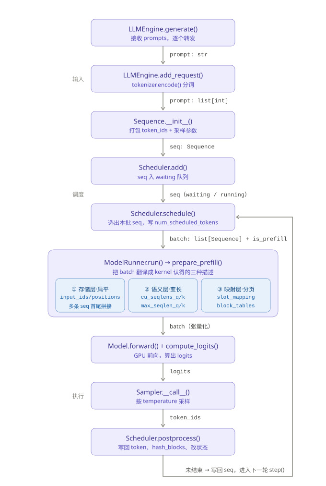

# 基于nano-vllm的阅读笔记



## config-参数的意义

```python
@dataclass(slots=True)
class Config:
    model: str                             # 模型名字
    max_num_batched_tokens: int = 16384    # 单批次所有序列最大可被处理token数量
    max_num_seqs: int = 512                # 一个批次中最大能被处理的序列数量
    max_model_len: int = 4096              # 模型一条序列的最长长度
    gpu_memory_utilization: float = 0.9    # gpu显存使用比例
    tensor_parallel_size: int = 1          # gpu并行数量
    enforce_eager: bool = False            # 使用cuda_graph
    hf_config: AutoConfig | None = None    # huggingface配置文件
    eos: int = -1                          # 结束符号tokenizer编码
    kvcache_block_size: int = 256          # 块大小
    num_kvcache_blocks: int = -1           # 块数量
```

### what is sequence?

在example.py中，传入llmengine的generate()的是我们熟悉的prompts列表。

在下面的generate函数里，将prompts和对应的采样参数打包传进add_request(),

```python
        if not isinstance(sampling_params, list):
            sampling_params = [sampling_params] * len(prompts)
        for prompt, sp in zip(prompts, sampling_params):
            self.add_request(prompt, sp)
```

在add_request的函数本体中，我们可以看到，sequence是包含分词解码后的prompt和对应的采样参数的一种数据结构。

```python
    def add_request(self, prompt: str | list[int], sampling_params: SamplingParams):
        if isinstance(prompt, str):
            prompt = self.tokenizer.encode(prompt)
        seq = Sequence(prompt, sampling_params)
        self.scheduler.add(seq)
```

### what is batch？

#### sequence是怎么成为batch的呢？

让我们跟随warmup的流程进行简单的探索。

```python
    def warmup_model(self):
        torch.cuda.empty_cache() 
        torch.cuda.reset_peak_memory_stats() # 清空缓存
        # 接下来我们获取了两个最大数量
        max_num_batched_tokens, max_model_len = self.config.max_num_batched_tokens, self.config.max_model_len
        
        # 你可以想象一个定长的batch再往里面装序列，序列短的时候就要多放几条，长的时候只能截断，所以一条序列的长度是取两个“最大”的最小值
        seq_len = min(max_num_batched_tokens, max_model_len)
        # 不能超过配置上限
        num_seqs = min(max_num_batched_tokens // seq_len, self.config.max_num_seqs)
        seqs = [Sequence([0] * seq_len) for _ in range(num_seqs)] # 使用最大开销的假序列跑预热
        for seq in seqs:
            seq.num_scheduled_tokens = seq_len # 注意这里本来是由调度器决定的，这里warmup进行了绕过
        self.run(seqs, True)
        torch.cuda.empty_cache()
```

这里我们获得了整齐的seqs列表。
  
正常情况，由scheduler调度num_scheduled_tokens，再在llmengine中调用run，warmup进行了绕过调度器的动作，直接调用run。
  
在run里面，我们迎来第一个区别prefill和decode的地方。

```python
    def run(self, seqs: list[Sequence], is_prefill: bool) -> list[int]:
        input_ids, positions = self.prepare_prefill(seqs) if is_prefill else self.prepare_decode(seqs)
```

此时，is_prefill为初始值1，我们进入到`prepare_prefill`

#### 关键处：从 Sequence 语义到 kernel 语义的翻译

这段代码很长，先不关注它的细节，简要地说它做的事情是：**把上面的对齐的sequence列表拼接成扁平形式**并计算变长注意力所需的累积长度、位置索引和最大长度信息。
  
这个扁平的序列————`input_ids[]`就是warm_up跑的一个batch，但这只是简化的说法，更准确地说法应该是：

- batch = 一组被调度的 Sequence
- 它们在存储层被扁平化成 input_ids（token 序列）
- 在语义层被 cu_seqlens_q/k + max_seqlen_q/k 描述成多个变长序列
    
  这三者合起来才构成 varlen attention 能理解的“batch”

> 这里提到了*varlen attention*，变长注意力，将在后面再作讨论。

```python
    def prepare_prefill(self, seqs: list[Sequence]):
        input_ids = []
        positions = []
        cu_seqlens_q = [0]
        cu_seqlens_k = [0]
        max_seqlen_q = 0
        max_seqlen_k = 0
        slot_mapping = []
        block_tables = None
        for seq in seqs:
            # 确定本次prefill的范围[上次缓存结束的地方+本次调度长度]
            start = seq.num_cached_tokens
            seqlen_q = seq.num_scheduled_tokens # Query序列长度即为本次需要调度的tokens，由调度器决定，在warmup里被绕过
            end = start + seqlen_q

            seqlen_k = end

            input_ids.extend(seq[start:end]) # 记录prefill序列，扁平化拼接
            positions.extend(range(start, end)) # 记录prefill序列位置索引

            # 用于FlashAttention的变长注意力
            cu_seqlens_q.append(cu_seqlens_q[-1] + seqlen_q)
            cu_seqlens_k.append(cu_seqlens_k[-1] + seqlen_k)
            max_seqlen_q = max(seqlen_q, max_seqlen_q)
            max_seqlen_k = max(seqlen_k, max_seqlen_k)
```

在拼接结束后，我们又回到run里面，进入到关键的`run_model`里，我们跟着`input_ids` 的步伐走即可

```python
    def run(self, seqs: list[Sequence], is_prefill: bool) -> list[int]:
        input_ids, positions = self.prepare_prefill(seqs) if is_prefill else self.prepare_decode(seqs)
        temperatures = self.prepare_sample(seqs) if self.rank == 0 else None # 张量化采样温度
        logits = self.run_model(input_ids, positions, is_prefill)
        token_ids = self.sampler(logits, temperatures).tolist() if self.rank == 0 else None
        reset_context()
        return token_ids
```

```python
    @torch.inference_mode()
    def run_model(self, input_ids: torch.Tensor, positions: torch.Tensor, is_prefill: bool):
        if is_prefill or self.enforce_eager or input_ids.size(0) > 512:
            return self.model.compute_logits(self.model(input_ids, positions))
```

is_prefill=1 调用模型跑一次预热，返回。
  
再调用sampler获得输出，重置上下文。
  
这就是warm_up的全流程。

这下我们不仅知道了什么是**batch**，还跑通过了一次warmup流程


### 真正的prefill流程
在我们讨论这个主题之前，应该要明白一件事情，上面所讨论的warmup是发生在model_runner这个模块上的。
为什么属于model——runner呢？
warmup的目的：
- 触发kernel的初始化
- 捕获cuda graph
- 缓存预热(运行时/编译/显存池层面的缓存，和 KV cache 是两回事)
- 触发triton.compile
而model_runner的职责就是桥接调度器所调度的sequence和gpu所执行的batch。
很显然，warmup要干的事情是在model_runner层面上。

所以接下来我们要讨论的模块就不只在model_runner上了。

在llmengine实例化时，在每个进程上各自实例化一个modelrunner。
modelrunner实例化时进行warmup。
warup之后就是allocate_kv_cache
> paged attention的物理基础，详见后文

接着捕获cuda graph
> 详见后文

如果并行数>1,给各进程初始化sharememory。
**至此，modelrunner的初始化完成。**
接下来回到llm_engine继续初始化，完成分词器调度器的初始化，最后注册一个退出函数，在程序执行结束后自动回收资源。

#### step 踏进prompts的全生命中
在llm_engine中，generate()包装了输出格式，而里面所调用的step()是真正进入推理的入口。

```python
    def step(self):
        seqs, is_prefill = self.scheduler.schedule()
        num_tokens = sum(seq.num_scheduled_tokens for seq in seqs) if is_prefill else -len(seqs)
        token_ids = self.model_runner.call("run", seqs, is_prefill)
        self.scheduler.postprocess(seqs, token_ids, is_prefill)
        outputs = [(seq.seq_id, seq.completion_token_ids) for seq in seqs if seq.is_finished]
        return outputs, num_tokens
```
sceduler进行调度，决定处理哪些token->model_runner对scheduled_tokens执行run->调度器进行后处理，将新生成token写回序列，检查是否结束
这是prompt整个生命周期的一次迭代。它的生命周期需要多次迭代才能完成。

#### schedule 指挥交通

##### prefill和decode的序列如何区分？
在llmengine中，在step()之前，先完成了准备工作————将sequence加入scheduler的waitting队列。

而在scheduler里：
- self.waiting 队列：存放的都是尚未完成 Prefill 或者被抢占后需要重新 Prefill（Re-prefill）的序列。
- self.running 队列：存放的都是已经完成 Prefill，正在进行 Decode（逐个生成 token）的序列。

```python
self.waiting: deque[Sequence] = deque()
self.running: deque[Sequence] = deque()
```

带着这个前提我们就可以进入最关键的schedule()中了。

#### prefill————整个推理流程开始的地方。

```python
    def schedule(self) -> tuple[list[Sequence], bool]:
        # 初始化
        scheduled_seqs = [] 
        num_batched_tokens = 0

        # prefill
        while self.waiting and len(scheduled_seqs) < self.max_num_seqs: # 目标：填满一个batch；限制条件：不超过最大序列数
            seq = self.waiting[0] # 本次处理的序列
            # 计算剩余的batch容量，当batch容量归零时退出
            remaining = self.max_num_batched_tokens - num_batched_tokens
            if remaining == 0:
                break

            # 计算本次需要处理的token数
            if not seq.block_table: # 首次prefill的情况
                num_cached_blocks = self.block_manager.can_allocate(seq) # 在计算kvcache是否有足够容量的同时返回缓存块数
                if num_cached_blocks == -1: # cache空间不足直接返回
                    break
                num_tokens = seq.num_tokens - num_cached_blocks * self.block_size 
            else: # 对应chunked prefill和重新抢占的情况
                num_tokens = seq.num_tokens - seq.num_cached_tokens

            # 调度策略：只允许第一个序列进行chunked prefill
            if remaining < num_tokens and scheduled_seqs:  # only allow chunked prefill for the first seq
                break
            
            if not seq.block_table: # 首次prefill则进行分块（block),详见后续的pagedAttention部分
                self.block_manager.allocate(seq, num_cached_blocks)
            
            # 调度的本体
            seq.num_scheduled_tokens = min(num_tokens, remaining) # 只有chunked prefill会使用remaining，这是调度策略决定的
            num_batched_tokens += seq.num_scheduled_tokens
            if seq.num_cached_tokens + seq.num_scheduled_tokens == seq.num_tokens: # 如果一个序列已经全部token已被调度，则转入decode阶段
                seq.status = SequenceStatus.RUNNING
                self.waiting.popleft()
                self.running.append(seq)
            scheduled_seqs.append(seq)

        if scheduled_seqs: # 本次prefill有被调度序列则返回
            return scheduled_seqs, True
```

这里要做的事情其实很简单：
当waitting队列非空时，就以填满一个batch的目标循环地取waitting队列的一个序列，通过计算这个序列的需要被处理的token数，根据调度策略判断是否调度这个序列，若不调度则退出，若调度则写入调度信息，继续进行下一轮。

值得注意的是：这里采用的调度策略是只有第一个序列进行chunked prefill
这种策略比较低效。
严格来说，这里只是作了简单的分块，而不是真正的chunked prefill。

在调度完成后，返回了*被调度序列列表*和*is_prefill*标志。接着llmengine继续调用model_runner进行run的动作。

在上面的warmup流程中我们跑过一次run流程。
简单来说，就是准备模型前向传播的两个参数：batch和采样参数；然后进行模型的前向传播；再对前向传播的结果logits进行采样获取输出。
但是在warmup里我们做得并不完整。

接下来我们继续看run的开始————prepare_prefill。
前面的代码和warmup里那部分一样，不多赘述，只需记住完成了sequence的扁平化拼接和varlen attention的准备工作。

我们看到后续的部分，它们做的事总结起来就是**将逻辑块映射到物理块**、**如有历史KV则传页表**、**gpu的准备工作**。

```python
        for seq in seqs:
            start = seq.num_cached_tokens
            seqlen_q = seq.num_scheduled_tokens
            end = start + seqlen_q
            seqlen_k = end
            input_ids.extend(seq[start:end])
            positions.extend(range(start, end))
            cu_seqlens_q.append(cu_seqlens_q[-1] + seqlen_q)
            cu_seqlens_k.append(cu_seqlens_k[-1] + seqlen_k)
            max_seqlen_q = max(seqlen_q, max_seqlen_q)
            max_seqlen_k = max(seqlen_k, max_seqlen_k)
            if not seq.block_table:    # warmup
                continue

            # 从此处开始：
            # 这里是将逻辑上的分块映射到物理块上，详见后续pagedAttention部分
            start_block = start // self.block_size
            end_block = (end + self.block_size - 1) // self.block_size
            for i in range(start_block, end_block):
                slot_start = seq.block_table[i] * self.block_size
                if i == start_block:
                    slot_start += start % self.block_size
                if i != end_block - 1:
                    slot_end = seq.block_table[i] * self.block_size + self.block_size
                else:
                    slot_end = seq.block_table[i] * self.block_size + end - i * self.block_size
                slot_mapping.extend(range(slot_start, slot_end))

        # 如果存在历史KV就将页表张量化以供kernel使用
        if cu_seqlens_k[-1] > cu_seqlens_q[-1]:    # prefix cache
            block_tables = self.prepare_block_tables(seqs)
        
        # 将上述存好的数据张量化供kernel使用
        input_ids = torch.tensor(input_ids, dtype=torch.int64, pin_memory=True).cuda(non_blocking=True)
        positions = torch.tensor(positions, dtype=torch.int64, pin_memory=True).cuda(non_blocking=True)
        cu_seqlens_q = torch.tensor(cu_seqlens_q, dtype=torch.int32, pin_memory=True).cuda(non_blocking=True)
        cu_seqlens_k = torch.tensor(cu_seqlens_k, dtype=torch.int32, pin_memory=True).cuda(non_blocking=True)
        slot_mapping = torch.tensor(slot_mapping, dtype=torch.int32, pin_memory=True).cuda(non_blocking=True)
        set_context(True, cu_seqlens_q, cu_seqlens_k, max_seqlen_q, max_seqlen_k, slot_mapping, None, block_tables)
        return input_ids, positions
```
 
准备工作做完以后就进行模型模型的前向传播计算，在prefill阶段，不使用cuda graph，进行即时计算。计算结果logits进行进行采样获得输出列表，将结果返回。

run执行结束，返回llmengine，执行调度器的后处理阶段。
后处理阶段所做的的事情是：对于batch里的每条序列进行**哈希计算与缓存注册**、**调度token数转化为cached_token数**；如果是未完成的prefill阶段**不写生成token**、其他情况**写生成token**与**检查是否到达结束条件，若结束则改变序列的一系列状态参数**。

###### 哈希计算与缓存注册

```python
    def hash_blocks(self, seq: Sequence):
        start = seq.num_cached_tokens // self.block_size
        end = (seq.num_cached_tokens + seq.num_scheduled_tokens) // self.block_size
        if start == end: return # 必须是完整的block才能进行缓存注册
        h = self.blocks[seq.block_table[start - 1]].hash if start > 0 else -1 # 获得链式哈希的起点
        for i in range(start, end): # 对于每个已经缓存好的块
            block = self.blocks[seq.block_table[i]]
            token_ids = seq.block(i)
            h = self.compute_hash(token_ids, h) # 计算其哈希值
            block.update(h, token_ids) # 更新其哈希值
            self.hash_to_block_id[h] = block.block_id # 缓存注册：创建哈希值和block_id的键值对
```

>prefix caching:
>can_allocate:查哈希获取命中缓存块数->allocate:处理命中缓存块->prepare_prefill:将缓存命中的块的对应页表传入kernel->hash_blocks:将新产生的缓存进行注册

最后，进行完后处理，对于batch中的每个序列，如果序列状态是FINISHING就将推理产生的tokens写入ouputs。

至此为止，我们已经了解了prefill的全流程。

#### decode 解码阶段

经过了上述漫长的流程后重新回到llmengine的generate()中，在调度器的waiting或running队列非空时，engine的工作都还未完成。

step()会进行不断地工作，直至waiting队列为空，prefill才算完全完成，这时候调度器的schedule会进入decode阶段。

```python
        # decode
        # 这个阶段每个序列都只需要调度一个token，所以上限就是一个batch最大容纳的sequence数量
        while self.running and len(scheduled_seqs) < self.max_num_seqs:
            seq = self.running.popleft()
            # 当序列新增的那个token正好需要新增一个block来容纳时，需要至少一个空闲块。这里就是检查这种情况。
            while not self.block_manager.can_append(seq): # 如果不能容纳，recompute
                # 抢占机制：preempt，将序列插入waiting队列的队首在下一轮重新prefill
                if self.running:  
                    self.preempt(self.running.pop()) # 从队列右端踢出一个序列释放其显存
                else: # 可能是OOM的情况
                    self.preempt(seq) # 释放当前序列
                    break
            else:# 能容纳时
                seq.num_scheduled_tokens = 1
                seq.is_prefill = False
                self.block_manager.may_append(seq)
                scheduled_seqs.append(seq)
        assert scheduled_seqs
        self.running.extendleft(reversed(scheduled_seqs)) # 使running队列保持原样
        return scheduled_seqs, False
```

recompute比较低效，在sequence.py中实现了序列化和反序列化的魔法方法，可以用于进行swap这种比较高效的方法：将暂时不运行的序列的kvcache换到cpu内存中，要用时再换回来。

然后进入run，继续类似prefill阶段的流程：prepare_decode、model_run使用cuda praph获得输出logits，采样获得token。

> 关于cuda praph的部分见后文。

```python
    def prepare_decode(self, seqs: list[Sequence]):
        input_ids = []
        positions = []
        slot_mapping = []
        context_lens = []
        for seq in seqs:
            input_ids.append(seq.last_token)
            positions.append(len(seq) - 1)
            context_lens.append(len(seq))
            slot_mapping.append(seq.block_table[-1] * self.block_size + seq.last_block_num_tokens  - 1)
        input_ids = torch.tensor(input_ids, dtype=torch.int64, pin_memory=True).cuda(non_blocking=True)
        positions = torch.tensor(positions, dtype=torch.int64, pin_memory=True).cuda(non_blocking=True)
        slot_mapping = torch.tensor(slot_mapping, dtype=torch.int32, pin_memory=True).cuda(non_blocking=True)
        context_lens = torch.tensor(context_lens, dtype=torch.int32, pin_memory=True).cuda(non_blocking=True)
        block_tables = self.prepare_block_tables(seqs)
        set_context(False, slot_mapping=slot_mapping, context_lens=context_lens, block_tables=block_tables)
        return input_ids, positions
```

同样地，接着进行后处理。

这就是decode过程。

### varlen attention

整体认知：
*主要用于prefill阶段，decode阶段用不上*
因为prefill阶段序列长度不定，decode阶段序列每次输出一个token，形状规整。

#### 所需参数
context是一个类似于config，它保存着全局的参数。
不妨这样理解，config是对sequence的解释，context是对batch的解释。
这可以构成良好的对偶。
> 但是要认识到这只是很简化的说法，事实上config里包含了全局的配置信息，不止属于sequence。
当然在逻辑上，我们应该认识到context是属于**当前这一轮 forward 的整个 batch**的上下文。

在context.py中我们可以看到先前在prepare_pefill里就看到的一些参数。
在理解这些参数时我们也可以结合prepare_refill的代码。
```python
@dataclass(slots=True)
class Context:
    is_prefill: bool = False # 是否属于prefill阶段
    # varlen attetion所需参数
    cu_seqlens_q: torch.Tensor | None = None
    cu_seqlens_k: torch.Tensor | None = None
    max_seqlen_q: int = 0
    max_seqlen_k: int = 0
    slot_mapping: torch.Tensor | None = None
    context_lens: torch.Tensor | None = None
    block_tables: torch.Tensor | None = None
```

### paged attention
#### PCB————sequence
PagedAttention 就像是操作系统的虚拟内存机制（分页、页表、物理页框）。

Sequence 就像是操作系统里的进程控制块（PCB）。

block_table 就像是 PCB 里的页表指针。
#### 物理基础

modelrunner在warmup之后就开始分配kvcache,cache块的分配是paged attention的物理基础。
直接来看这个函数的实现。

```python
    def allocate_kv_cache(self):
        # 加载配置信息
        config = self.config
        hf_config = config.hf_config

        # 计算可用显存
        free, total = torch.cuda.mem_get_info()
        used = total - free
        # 计算pytorch缓存分配器占用
        peak = torch.cuda.memory_stats()["allocated_bytes.all.peak"]
        current = torch.cuda.memory_stats()["allocated_bytes.all.current"]

        num_kv_heads = hf_config.num_key_value_heads // self.world_size # 当前gpu所持有的头数
        head_dim = getattr(hf_config, "head_dim", hf_config.hidden_size // hf_config.num_attention_heads)
        # 计算一个块在KVcache占用的字节数
        block_bytes = 2 * hf_config.num_hidden_layers * self.block_size * num_kv_heads * head_dim * hf_config.dtype.itemsize
        # 计算kvcache的分块数量
        config.num_kvcache_blocks = int(total * config.gpu_memory_utilization - used - peak + current) // block_bytes
        assert config.num_kvcache_blocks > 0

        # KVcache的创建————大张量
        # 维度：dim0划分K和V；dim1是层；后面的是分页管理所需维度
        self.kv_cache = torch.empty(2, hf_config.num_hidden_layers, config.num_kvcache_blocks, self.block_size, num_kv_heads, head_dim)

        # 遍历模型找到每个带kvcache的层，分配kccache给它
        layer_id = 0
        for module in self.model.modules():
            if hasattr(module, "k_cache") and hasattr(module, "v_cache"):
                module.k_cache = self.kv_cache[0, layer_id]
                module.v_cache = self.kv_cache[1, layer_id]
                layer_id += 1
```

#### 逻辑块到物理块的转换

##### what is block?
调度器在调度batch时进行分块。**这时对象是一条完整的序列**

先看**Block**的数据结构：

首先，一个序列的逻辑划分本质是数学映射：sequence的input_id[]按block_size作顺序切分。在进行这样的划分后，我们得到了block所存的token。

在block_manage里，block的哈希值和索引是一键值对；哈希值由tokens得到。
即通过添加键值对的操作，可以将block所存token与索引建立映射关系。

此处的block_id是对KVcache分块的抽象。可以看作block_id表示物理层的块。

```python
class Block:

    def __init__(self, block_id):
        self.block_id = block_id # 索引
        self.ref_count = 0       # 引用数
        self.hash = -1           # 哈希值
        self.token_ids = []      # 内容：所存tokens
```

真正让逻辑分块获得物理实体的是调度器调用的block_manager的allocate方法：

```python
    def allocate(self, seq: Sequence, num_cached_blocks: int):
        assert not seq.block_table
        h = -1

        # 首先是对于命中缓存的块,只有先前缓存过的块才能根据哈希值找到块id
        for i in range(num_cached_blocks):
            # 根据哈希值获得块id
            token_ids = seq.block(i)
            h = self.compute_hash(token_ids, h)
            block_id = self.hash_to_block_id[h]
            # 再根据块id
            block = self.blocks[block_id]
            if block_id in self.used_block_ids:# 检查该块是否被引用
                block.ref_count += 1 # 若有，则引用数+1
            else:# 若无，则在引用数+1的同时修改块管理器相应参数
                block.ref_count = 1
                self.free_block_ids.remove(block_id)
                self.used_block_ids.add(block_id)
            seq.block_table.append(block_id)
        
        # 对于缓存未命中的块
        for i in range(num_cached_blocks, seq.num_blocks):
            seq.block_table.append(self._allocate_block()) # 从块池获得一个空闲块
        seq.num_cached_tokens = num_cached_blocks * self.block_size
```

将块与sequence建立映射关系的关键是在sequence的block_table添加块。

##### what is slot?
上面做的是*让sequence的逻辑分块获得物理实体*，接下来做的是*让batch的计算精确对齐KVcache的slot*

**这时的对象是sequence中被调度的tokens，或者说batch里的token**

而相应地，slot即是block里的单位：

```text
num_slot = num_block * block_size
```

```python
        for seq in seqs:
            start = seq.num_cached_tokens
            seqlen_q = seq.num_scheduled_tokens
            end = start + seqlen_q
            seqlen_k = end
            input_ids.extend(seq[start:end])
            positions.extend(range(start, end))
            cu_seqlens_q.append(cu_seqlens_q[-1] + seqlen_q)
            cu_seqlens_k.append(cu_seqlens_k[-1] + seqlen_k)
            max_seqlen_q = max(seqlen_q, max_seqlen_q)
            max_seqlen_k = max(seqlen_k, max_seqlen_k)
            if not seq.block_table:    # warmup
                continue

            # 从此处开始：
            # 计算当前被处理的tokens的开始和结束位置的逻辑块在block_table中的的位置
            start_block = start // self.block_size
            end_block = (end + self.block_size - 1) // self.block_size
            # 将每个块需要被调度的slot添加到slot_mapping队列
            for i in range(start_block, end_block):
                slot_start = seq.block_table[i] * self.block_size # 对应的block_id * block_size
                if i == start_block: # 精确寻址到开始的那个token所在位置
                    slot_start += start % self.block_size
                if i != end_block - 1: # 完整的一个block
                    slot_end = seq.block_table[i] * self.block_size + self.block_size
                else: # 精确寻址到结束的那个token所在位置
                    slot_end = seq.block_table[i] * self.block_size + end - i * self.block_size
                slot_mapping.extend(range(slot_start, slot_end))
```

至此，batch中所要被调度的token对应的block中的slot被保存在了一个队列中。
与sequence被切分成batch类似，从block到slot是粒度的细化。


### graph capture
整体认知：
*这里捕获的图只用于decode阶段*
在decode阶段，每次调度一个序列只生成一个token，batch_size只有一个自由度————num_seqs

```python
    @torch.inference_mode()
    def capture_cudagraph(self):
        config = self.config
        hf_config = config.hf_config

        # 最大batch_size,与单个批次最多调度序列数有关
        max_bs = min(self.config.max_num_seqs, 512)
        # 最大块数
        max_num_blocks = (config.max_model_len + self.block_size - 1) // self.block_size

        # 模型输入
        input_ids = torch.zeros(max_bs, dtype=torch.int64)
        positions = torch.zeros(max_bs, dtype=torch.int64)

        # 在context.py中的参数中的前缀和数组没有意义了，因为序列定长。
        slot_mapping = torch.zeros(max_bs, dtype=torch.int32)
        context_lens = torch.zeros(max_bs, dtype=torch.int32)
        # 两个维度：batch维度、block维度
        # 一个维度用来定位“哪条序列”，一个用来定位“这条序列的哪段KVcache”
        block_tables = torch.zeros(max_bs, max_num_blocks, dtype=torch.int32)

        outputs = torch.zeros(max_bs, hf_config.hidden_size)

        self.graph_bs = [1, 2, 4, 8] + list(range(16, max_bs + 1, 16)) # 低并发和高并发场景
        self.graphs = {}
        self.graph_pool = None

        for bs in reversed(self.graph_bs):
            graph = torch.cuda.CUDAGraph()
            set_context(False, slot_mapping=slot_mapping[:bs], context_lens=context_lens[:bs], block_tables=block_tables[:bs])
            outputs[:bs] = self.model(input_ids[:bs], positions[:bs])    # warmup
            with torch.cuda.graph(graph, self.graph_pool):
                outputs[:bs] = self.model(input_ids[:bs], positions[:bs])    # capture
            if self.graph_pool is None:
                self.graph_pool = graph.pool()
            self.graphs[bs] = graph
            torch.cuda.synchronize()
            reset_context()

        # 持有引用，防止回收；decode时replay图的桥梁
        self.graph_vars = dict(
            input_ids=input_ids,
            positions=positions,
            slot_mapping=slot_mapping,
            context_lens=context_lens,
            block_tables=block_tables,
            outputs=outputs,
        )
```

```python
    @torch.inference_mode()
    def run_model(self, input_ids: torch.Tensor, positions: torch.Tensor, is_prefill: bool):
        if is_prefill or self.enforce_eager or input_ids.size(0) > 512:
            return self.model.compute_logits(self.model(input_ids, positions))
        else:
            bs = input_ids.size(0)
            context = get_context()
            graph = self.graphs[next(x for x in self.graph_bs if x >= bs)]
            graph_vars = self.graph_vars
            graph_vars["input_ids"][:bs] = input_ids
            graph_vars["positions"][:bs] = positions
            graph_vars["slot_mapping"].fill_(-1)
            graph_vars["slot_mapping"][:bs] = context.slot_mapping
            graph_vars["context_lens"].zero_()
            graph_vars["context_lens"][:bs] = context.context_lens
            graph_vars["block_tables"][:bs, :context.block_tables.size(1)] = context.block_tables
            graph.replay()
            return self.model.compute_logits(graph_vars["outputs"][:bs])
```